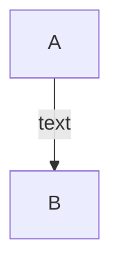

# はじめに
diffusionについて何が何だかわからなくなってきたのでまとめる

# 文字でのdiffusionの説明
### diffusionでできること
ノイズからデータを生成できる(生成モデル)
### diffusionのこれまでの生成モデルとは違う部分
データに乗ってるノイズを徐々にとっていき、最終的にきれいなデータを生成する。一つのモデルでどんどんiterativeにノイズをとっていく。これまではノイズをモデルに一回通してデータを生成するものが多かった。たとえるなら、絵にどんどん加筆していく感じ。人間もそうやって絵を描いていく(ここは最終的に強化学習になっていくのではないかと思う)。
### diffusionの工夫部分
データのノイズを乗せる時に、繰り返しのせて、乗っているノイズを予測するのは大変。一発でたくさんノイズがのっているデータを生成する生成する。


# 数式でのdiffusionの説明(結果とお気持ち)
[Ho et al. 2020](https://arxiv.org/abs/2006.11239)の場合
### データにノイズを乗せる（1step）
ノイズステップt-1のデータ$\mathbf{x_{t-1}}$にノイズを乗せて、$\mathbf{x_t}$のデータを生成する。データは少し弱めて、その分ノイズをのせるので、最後はただのノイズになる。
```math
\mathbf{x_t} = \sqrt{\alpha_t}\mathbf{x_{t-1}}+\sqrt{1-\alpha_t}\mathbf{z_t} \\
\mathbf{z_t} \sim \mathcal{N}(\mathbf{0}, \mathbf{I}) \\
0<\alpha_T<\alpha_{T-1}<...<\alpha_1<\alpha_0<1
```

### ノイズ入りデータからノイズなしデータをサンプリング（1step）
$\mathbf{x_t}$から、$\mathbf{x_{t-1}}$を作る。色々なデータを作れるように、ノイズも入れる。
```math
\mathbf{x_{t-1}} = \mathbf{\mu_\theta}(\mathbf{x_t}, t)+\Sigma_\mathbf{\theta}(\mathbf{x_t}, t)\mathbf{z} \\
\left\{
\begin{array}{ll}
\mathbf{z} \sim \mathcal{N}(\mathbf{0}, \mathbf{I}) & (t \geq 1)\\
\mathbf{0} & else
\end{array}
\right.
```
## 実際
### 学習時
①データにノイズを乗せる
ノイズなしのデータ$\mathbf{x_0}$にノイズを乗せて、$t$分のノイズが乗った$\mathbf{x_t}$を一発で作る（本来何回も乗せる必要がある）。ノイズの乗せ加減は1stepでノイズの乗せ具合$\alpha_t$から計算する。
```math
\mathbf{x_t} = \sqrt{\overline{\alpha_t}}\mathbf{x_0}+\sqrt{1-\overline{\alpha_t}}\mathbf{z_t} \\
\mathbf{z_t} \sim \mathcal{N}(\mathbf{0}, \mathbf{I}) \\
\overline{\alpha_t}:=\prod_{s = 1}^{t} \alpha_s
```

②乗ってるノイズを予測する関数を学習
$\mathbf{z_\theta}$はニューラルネットワークの関数。$\mathbf{x_{t}}$と$t$は入力。学習時はまず、tを決めて、ノイズ入りデータを作って、乗っているノイズを予測する。
```math
\nabla_\theta||\mathbf{z_t}-\mathbf{z_\theta(\mathbf{x_{t}}, t)})||^2
```

### データ生成時
デノイズステップtにおいて、$\mathbf{z_\theta(x_{t}, t)}$を推定して差し引く。差し引き加減は1stepでノイズの乗せ具合を考慮する。色々なデータを作れるように、ノイズも乗せる。最初は完全なノイズデータから始める。
```math
\mathbf{x_T} \sim \mathcal{N}(\mathbf{0}, \mathbf{I})

\\

\mathbf{x_{t-1}} = \frac{1}{\sqrt{\alpha_t}}(\mathbf{x_{t}}-\frac{1-\alpha_t}{\sqrt{1-\overline{\alpha_t}}}\mathbf{z_\theta(x_{t}, t)})+\sigma_t\mathbf{z} 

\\

\left\{
\begin{array}{ll}
\mathbf{z} \sim \mathcal{N}(\mathbf{0}, \mathbf{I}) & (t \geq 1)\\
\mathbf{0} & else
\end{array}
\right.
```
# 各論文の関係性




### Ho et al.(2020)
ノイズ$\nabla_\theta||\mathbf{z_t}-\mathbf{z_\theta(\mathbf{x_{t}}, t)})||^2$を予測することにした。
ロスの係数を無視することにした。

### Nichol & Dhariwal(2021)
スケジューリングのパラメータにコサインを使うことにした。
$\Sigma_\mathbf{\theta}(\mathbf{x_t}, t)$も学習することにした。

### Song et al.(2020)
サンプリング中にノイズを乗せるのをやめることにした。

# 参考
- [What are Diffusion Models?
](https://zenn.dev/nakky/articles/09fb1804001ff8)
- [拡散モデル データ生成技術の数理](https://www.iwanami.co.jp/book/b619864.html)
- Jascha Sohl-Dickstein et al. “Deep Unsupervised Learning using Nonequilibrium Thermodynamics.” ICML 2015.
- [Song et al.(2020)] Yang Song & Stefano Ermon. “Improved techniques for training score-based generative models.” NeuriPS 2020.
- [Ho et al.(2020)] Jonathan Ho et al. “Denoising diffusion probabilistic models.” arxiv Preprint arxiv:2006.11239 (2020). code
- [Nichol & Dhariwal(2021)] Alex Nichol & Prafulla Dhariwal. “ Improved denoising diffusion probabilistic models” arxiv Preprint arxiv:2102.09672 (2021). code
- [Nichol & Dhariwal(2021)] Praffula Dhariwal & Alex Nichol. “Diffusion Models Beat GANs on Image Synthesis.” arxiv Preprint arxiv:2105.05233 (2021). code
